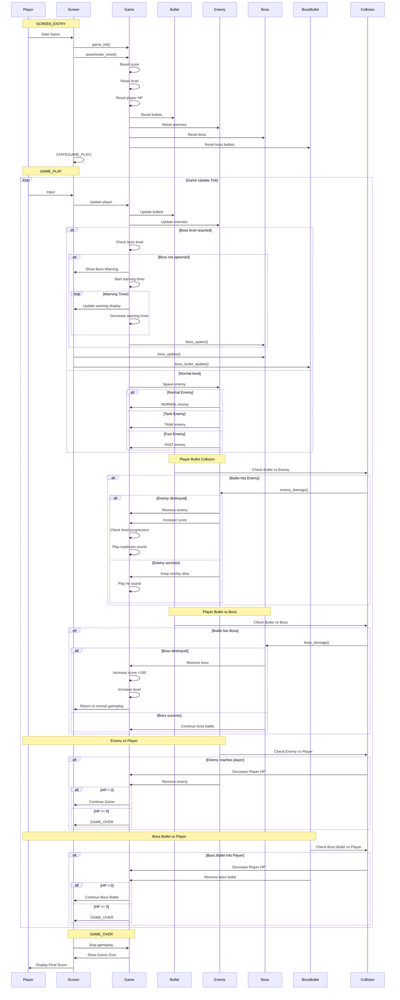

# AK Embedded Base Kit - STM32L151

[](https://github.com/the-ak-foundation)

This kit would not have been possible without the help of [EPCB](https://epcb.vn/pages/frontpage).

AK Embedded Base Kit, utilizing STM32L151 MCU, is an evaluation kit for advanced embedded software learners.

## Introduction

- This kit integrates 1.54" OLED LCD, 3 push buttons, and 1 buzzer, which would be sufficient to create a small video game with an event driven paradigm.
- It also includes RS485, Qwiic Connect System, and Grove Ecosystems, suitable for prototyping other practical applications in embedded systems.

## Gameplay Demo

<p align="center">
  
</p>

<h3 align="center">Normal Gameplay</h3>

<div align="center">

<video
src="https://github.com/user-attachments/assets/6b4184b1-db5c-4b26-8016-f5a1f6645dcd"
controls
width="640">
</video>

</div>

<h3 align="center">Boss Gameplay</h3>

<div align="center">

<video
src="https://github.com/user-attachments/assets/2105f960-b772-44c0-aa0e-dd4f937f867b"
controls
width="640">
</video>

</div>

### I. Hardware:
[](<https://epcb.vn/products/ak-embedded-base-kit-lap-trinh-nhung-vi-dieu-khien-mcu>)

## II. Game Description and Objects

Monster Shooter is an embedded shooting game developed for the AK Embedded Base Kit. 
The player controls a spaceship, destroys different types of monsters, avoids enemy attacks, 
and fights the boss to progress through the game.

### Objects in the Game

The game consists of several interactive objects that control the gameplay:

| Bitmap | Object Name | Description |
|:---:|:---|:---|
|  | **Player** | The main player-controlled spaceship. The player moves horizontally and fires projectiles to destroy enemies. |
|  | **Player Bullet** | A projectile fired by the player. It travels upward and damages enemies and the boss. |
|  | **Normal Enemy** | The standard enemy type. It moves toward the player and can damage the player on collision. |
|  | **Tank Enemy** | A durable enemy with higher health and requires more attacks to destroy. |
|  | **Fast Enemy** | A fast-moving enemy that increases gameplay difficulty. |
|  | **Boss** | A powerful enemy that appears at the boss level. The boss has high HP and launches projectiles at the player. |
|  | **Boss Bullet** | A projectile fired by the boss. The player must avoid it to prevent HP loss. |


<div align="center">

<table>
<tr>

<td align="center">
<br>
<b>Demo Screen</b>
</td>

<td align="center">
<br>
<b>Gameplay Screen</b>
</td>

<td align="center">
<br>
<b>Settings Screen</b>
</td>

</tr>
</table>

</div>

## Documentation

| File | Description |
|---|---|
| [README.md](README.md) | Main project overview, hardware information, gameplay rules, and game objects. |
| [docs/01-guide-getting-started.md](docs/01-guide-getting-started.md) | Getting started guide for building and running the Monster Shooter game. |
| [docs/02-project-overview.md](docs/02-project-overview.md) | Project overview, game structure, gameplay flow, and main game components. |
| [docs/03-software-architecture.md](docs/03-software-architecture.md) | Software architecture, object relationships, runtime flow, and event-driven design of the game. |

### III. How to Play:

- Press **DOWN** to move the player left.
- Press **UP** to move the player right.
- Press **MODE** to fire bullets.
- Destroy enemies to increase the score.
- Avoid enemy collisions and boss bullets.
- Defeat the boss to progress through the game.
- The game ends when the player's HP reaches zero.

### IV. Basic Game Sequence Logic

The following sequence diagram describes the basic runtime logic of **Monster Shooter**, including game initialization, player input, enemy spawning, bullet movement, collision detection, level progression, boss warning, boss battle, and game-over handling.



## Purpose

Students who are enrolled in the AK foundation's embedded training program will make use of this evaluation kit to develop a small unique video game that will be able to run smoothly as well as closely follow an event driven paradigm in embedded systems programming. This repository also contains all the code which would form the AK framework that students can use to facilitate their development process.

We also hope that this repository will also be useful for those are on the look out for a well-built kit to practice their embedded systems programming skills.


[](<https://epcb.vn/products/ak-embedded-base-kit-lap-trinh-nhung-vi-dieu-khien-mcu>)

## Memory map

AK base kit uses the following memory map to run its application code

- [ 0x08000000 ] : **Boot** [[ak-base-kit-stm32l151-boot.bin]](https://github.com/ak-embedded-software/ak-base-kit-stm32l151/blob/main/hardware/bin/ak-base-kit-stm32l151-boot.bin)
- [ 0x08002000 ] : **BSF** [ Memory for data sharing between Boot and Application ]
- [ 0x08003000 ] : **Application** [[ak-base-kit-stm32l151-application.bin]](https://github.com/ak-embedded-software/ak-base-kit-stm32l151/blob/main/hardware/bin/ak-base-kit-stm32l151-application.bin)                                             

>**Note:** After loading the boot and application firmware, you can use [AK - Flash](https://github.com/ak-embedded-software/ak-flash), a CLI to work with the AK base kit, to load the application directly through the kit's USB port. Once installed, the following command will flash user's defined code into the kit's application's memory region.

```sh
ak_flash /dev/ttyUSB0 ak-base-kit-stm32l151-application.bin 0x08003000
```

## Hardware Reference

[AK base kit's schematic](/hardware/schematic/schematic-ak-embedded-base-kit-version-3.pdf)

[](<https://epcb.vn/products/ak-embedded-base-kit-lap-trinh-nhung-vi-dieu-khien-mcu>)

[](https://epcb.vn/products/ak-embedded-base-kit-lap-trinh-nhung-vi-dieu-khien-mcu)

## Reference

| Topic | Link |
| ------ | ------ |
| Tutorials | <https://epcb.vn/blogs/ak-embedded-software> |
| Vendor | <https://epcb.vn/products/ak-embedded-base-kit-lap-trinh-nhung-vi-dieu-khien-mcu> |
