# Monster_Shooter_Game

## Introduction

- This kit integrates 1.54" OLED LCD, 3 push buttons, and 1 buzzer, which would be sufficient to create a small video game with an event driven paradigm.
- It also includes RS485, Qwiic Connect System, and Grove Ecosystems, suitable for prototyping other practical applications in embedded systems.

## Gameplay Demo

<p align="center">
  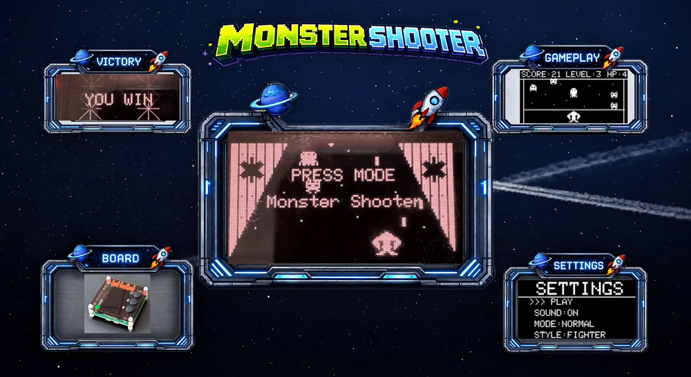
</p>

<h3 align="center">Normal Gameplay</h3>

<div align="center">

<video
src="
https://github.com/user-attachments/assets/533b893c-3640-409c-a472-ff8249c435cf"
controls
width="640">
</video>

</div>

## Documentation

| File | Description |
|---|---|
| [README.md](README.md) | Main project overview, hardware information, gameplay rules, and game objects. |
| [docs/01-guide_getting-started.md](docs/01-guide_getting-started.md) | Getting started guide for building and running the Monster Shooter game. |
| [docs/02-project-overview.md](docs/02-project-overview.md) | Project overview, game structure, gameplay flow, and main game components. |
| [docs/03-software-architecture.md](docs/03-software-architecture.md) | Software architecture, object relationships, runtime flow, and event-driven design of the game. |
### I. Hardware:
[](<https://epcb.vn/products/ak-embedded-base-kit-lap-trinh-nhung-vi-dieu-khien-mcu>)

The game is designed to run on the AK Embedded Base Kit. It utilizes a **1.54" OLED display** for graphics rendering, **three push buttons** for user input, and a **buzzer** for audio feedback. For more information about the board, see [AK Embedded Base Kit](https://epcb.vn/products/ak-embedded-base-kit-lap-trinh-nhung-vi-dieu-khien-mcu).

## II. Game Description and Objects

Monster Shooter is an embedded shooting game developed for the AK Embedded Base Kit. 
The player controls a spaceship, destroys different types of monsters, avoids enemy attacks, 
and fights the boss to progress through the game.

### Objects in the Game

The game consists of several interactive objects that control the gameplay:

| Bitmap | Object Name | Description |
|:---:|:---|:---|
| 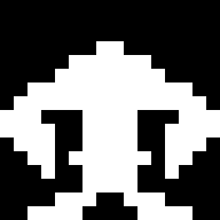 | **Player** | The main player-controlled spaceship. The player moves horizontally and fires projectiles to destroy enemies. |
|  | **Player Bullet** | A projectile specifically fired by the Player Tank. It travels upward and damages enemies and the boss. |
| 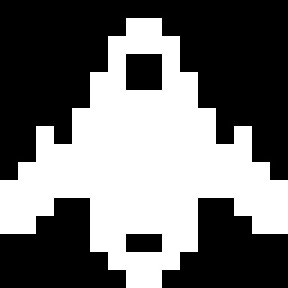 | **Player Tank** | An alternative player character style that can be selected in the game settings. It has a robust design. |
| 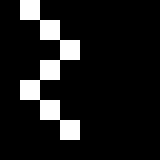 | **Tank Bullet** | A projectile fired by the Player. It travels upward and damages enemies and the boss. |
| 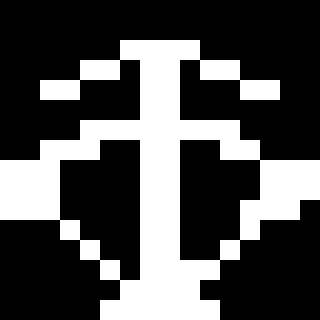 | **Player Archer** | Another alternative player character style available for selection, designed for precision. |
|  | **Archer Bullet** | An arrow-shaped projectile fired by the Player Archer. It travels upward and damages enemies and the boss. |
| 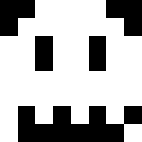 | **Normal Enemy** | The standard enemy type. It moves toward the player and can damage the player on collision. |
| 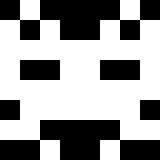 | **Tank Enemy** | A durable enemy with higher health and requires more attacks to destroy. |
| 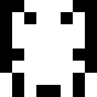 | **Fast Enemy** | A fast-moving enemy that increases gameplay difficulty. |
| 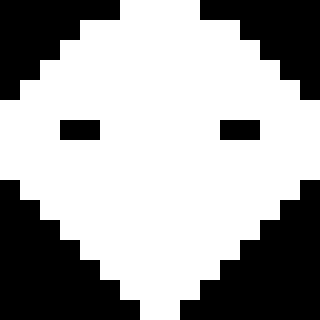 | **Boss** | A powerful enemy that appears at the boss level. The boss has high HP and launches projectiles at the player. |

<table align="center">
  <tr>
    <td align="center">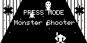</td>
  </tr>
</table>
<p align="center"><strong><em>Figure 1:</em></strong> Demo Screen </p>

<table align="center">
  <tr>
    <td align="center">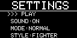</td>
  </tr>
</table>
<p align="center"><strong><em>Figure 2:</em></strong> Settings Screen </p>

By navigating the menu, players can access the **Settings Screen**, which offers the following options to configure the game: 
- **PLAY**: Start a new match and enter the main game.
- **SOUND**: Toggle the in-game audio ON or OFF.
- **MODE**: Select the difficulty level from 3 available modes (e.g., Normal, Hard).
- **STYLE**: Choose the player's character or spaceship design (e.g., Fighter).


<table align="center">
  <tr>
    <td align="center">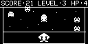</td>
  </tr>
</table>
<p align="center"><strong><em>Figure 3:</em></strong> Gameplay Screen </p>

Once **PLAY** is selected, players transition to the **Gameplay Screen**. This screen displays the active combat area along with a top status bar tracking the current **SCORE**, **LEVEL**, and remaining **HP** (Health Points).


### III. How to Play:

- Press **DOWN** to move the player left.
- Press **UP** to move the player right.
- Press **MODE** to fire bullets.
- Destroy enemies to increase the score.
- Avoid enemy collisions and boss bullets.
- Defeat the boss to progress through the game.
- The game ends when the player's HP reaches zero.

### IV. Basic Game Sequence Logic

The following sequence diagram describes the basic runtime logic of **Monster Shooter**, including game initialization, player input, enemy spawning, bullet movement, collision detection, level progression, boss warning, boss battle, and game-over handling.

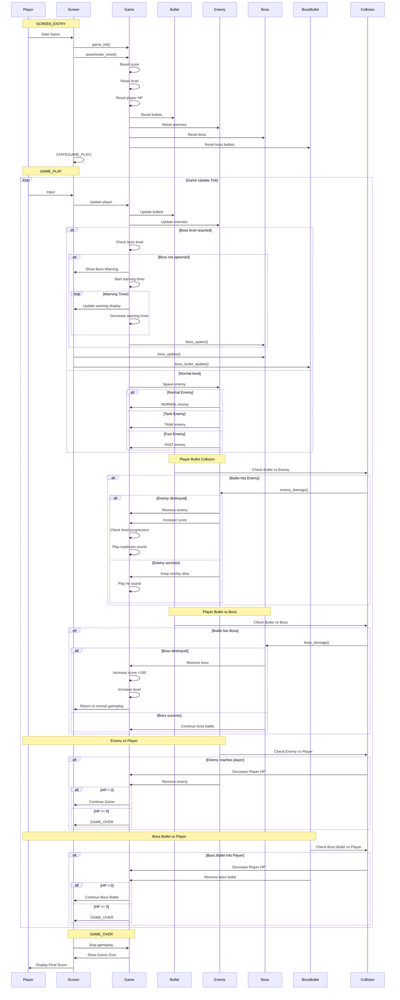
## Contact & Support
``` Note
Thank you for visiting this repository.
If you have any questions, suggestions, or feedback about this project, feel free to contact me directly.
```
