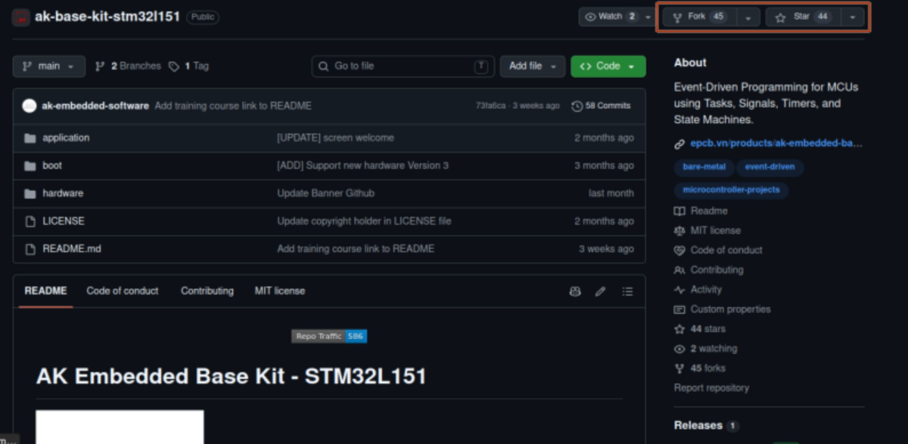

<h1 align="center">Game programming getting started guide</h1>

Welcome to the game programming project on the STM32L151 microcontroller! This repository provides a foundational source code base along with detailed documentation to help you quickly get familiar with the system architecture and start building your own game.

---

## Table of Contents

- [I. Create Your Own "Playground" (Fork)](#i-create-your-own-playground-fork)
- [II. Quick Start Guide (Environment Setup)](#ii-quick-start-guide-environment-setup)
- [III. Game Programming Workflow](#iii-game-programming-workflow)
  - [Step 1: Create your working directory](#step-1-create-your-working-directory)
  - [Step 2: Clone the repo to your machine](#step-2-clone-the-repo-to-your-machine)
  - [Step 3: Modify the Game](#step-3-modify-the-game)
  - [Step 4: Push your code to GitHub](#step-4-push-your-code-to-github)

---

## I. Create Your Own "Playground" (Fork)

To initialize your personal project, follow these steps:

### 1. Access the original repository

**Link:** [https://github.com/the-ak-foundation/ak-base-kit-stm32l151](https://github.com/the-ak-foundation/ak-base-kit-stm32l151)

### 2. Fork the repository

Click the **Fork** button in the top-right corner to create a copy of the project under your personal account.
You can also click the **Star** button next to **Fork** to support the author.

  

