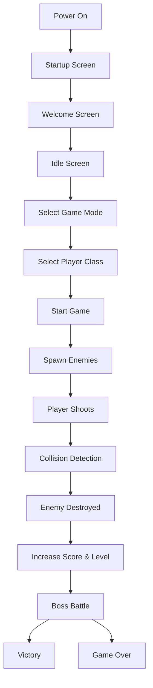
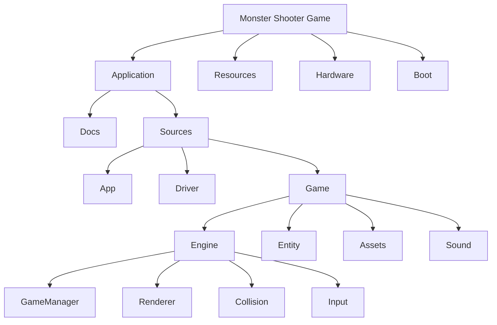

# Project Overview

---

## 1. Introduction

This project is a 2D lane-based shooting game developed for the AK Base Kit STM32L151 development board. The game is implemented in C/C++ using the AK Embedded Framework and is designed to run on a 128×64 OLED display.

In the game, the player controls a fighter aircraft that moves between six lanes, shoots incoming enemies, survives multiple enemy waves, and defeats a final boss. Different enemy types, player classes, difficulty modes, sound effects, and boss attack patterns provide a more engaging gameplay experience.

## 2. Hardware

The game is designed to run on the AK Base Kit STM32L151 development board. The following hardware components are used throughout the project.

| Component | Description |
|-----------|-------------|
| MCU | STM32L151CBT6 microcontroller |
| Display | 128 × 64 monochrome OLED |
| Buttons | UP, DOWN and MODE buttons for player control |
| Buzzer | Plays sound effects during gameplay |
| ST-LINK/V2 | Used to program and debug the firmware |
### Hardware Architecture

          +---------------------------+
          |      STM32L151 MCU        |
          +-------------+-------------+
                        |
        +---------------+---------------+
        |               |               |
     OLED Display    Buttons        Buzzer
        |               |               |
     Graphics       User Input      Sound Effects

### Hardware Features

- Low-power STM32L151 microcontroller
- 128×64 OLED display for graphics rendering
- Three physical buttons for gameplay
- Built-in buzzer for audio feedback
- ST-LINK interface for programming and debugging
## 3. Project Features

The game provides multiple gameplay mechanics and embedded system features to create an engaging arcade shooting experience.

### Gameplay Features

- Six-lane movement system
- Three selectable player classes
  - Fighter
  - Archer
  - Tank
- Three enemy types
  - Normal Enemy
  - Fast Enemy
  - Tank Enemy
- Boss battle with multiple attack phases
- Normal Mode and Hard Mode
- HP and score system
- Level progression
- Victory and Game Over screens

### Embedded Features

- Event-driven game loop
- Sprite-based graphics rendering
- AABB collision detection
- Object pool memory management
- Sound effects using buzzer
- OLED rendering optimization

## 4. Gameplay

The game begins by allowing the player to select a game mode and a player class. Once the game starts, enemies continuously appear from the top of the screen and move toward the bottom. The player must destroy these enemies while avoiding enemy attacks and preventing them from reaching the defense line.

As the game progresses, the difficulty gradually increases through stronger enemy types and higher enemy spawn rates. After reaching the required level, the player enters a boss battle. The boss has multiple attack phases that change according to its remaining HP, creating a more challenging combat experience.

The game ends in one of two conditions:

- **Victory:** The player defeats the final boss.
- **Game Over:** The player's HP reaches zero.
### Gameplay Flow

### Gameplay Stages

| Stage | Description |
|--------|-------------|
| Startup | Initialize the system |
| Welcome | Display welcome animation |
| Idle | Demonstration screen |
| Menu | Select game mode and player class |
| Gameplay | Main game loop |
| Boss Battle | Fight against the final boss |
| Victory | Display winning animation |
| Game Over | Display losing screen |
## 5. Controls

The game is controlled using the three physical buttons available on the AK Base Kit STM32L151 board.

| Button | Function |
|---------|----------|
| UP | Move the player upward or navigate upward in menus |
| DOWN | Move the player downward or navigate downward in menus |
| MODE | Confirm selections, start the game, and fire bullets during gameplay |
## 6. Project Structure

The project is organized into multiple modules to separate the application layer, gameplay logic, hardware drivers, and project resources. This modular organization improves code readability, simplifies maintenance, and makes future extensions easier.

| Folder | Description |
|---------|-------------|
| application | Main application source code |
| docs | Project documentation |
| sources | Main firmware source code |
| app | Screen management and application entry |
| driver | Hardware abstraction layer |
| game | Game implementation |
| engine | Game engine modules |
| entity | Player, enemy, bullet and boss objects |
| assets | Sprite resources |
| sound | Sound management |
| resources | Documentation resources and images |
| hardware | Hardware design files |
| boot | Bootloader project |
