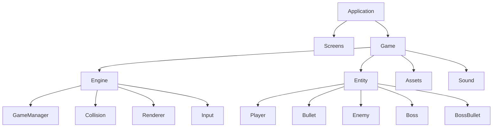

# Software Architecture

---

## 1. Overview

The project follows a modular architecture where the user interface, gameplay logic, rendering system, entity management, and hardware abstraction are separated into independent modules. This organization makes the project easier to maintain, extend, and debug.

The gameplay is driven by an event-based update loop. Each frame updates the game state, processes entity behaviors, performs collision detection, and renders the final frame to the OLED display.

## 2. High-Level Architecture

## 3. Module Responsibilities

| Module | Responsibility |
|----------|----------------|
| Screens | Manage game screens and user interaction |
| Engine | Control gameplay logic and rendering |
| Entity | Define all game objects |
| Assets | Store sprite resources |
| Sound | Manage buzzer sound effects |
### Engine Components

| Component | Responsibility |
|-----------|----------------|
| Game Manager | Initialize and update gameplay |
| Renderer | Draw game objects on the OLED |
| Collision | Detect collisions using AABB |
| Input | Process hardware button events |
### Game Entities

| Entity | Description |
|---------|-------------|
| Player | User-controlled aircraft |
| Bullet | Player projectile |
| Enemy | Regular enemies |
| Boss | Final stage boss |
| Boss Bullet | Boss projectile |

## 4. Runtime Architecture

---

## 5. Entity Relationship

---

## 6. Design Principles