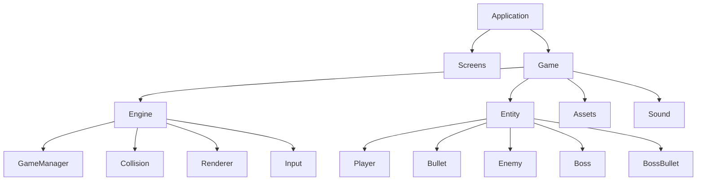
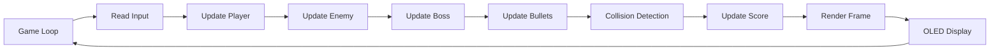
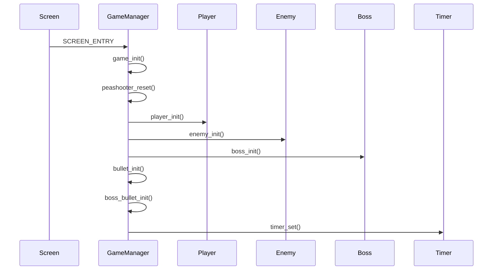
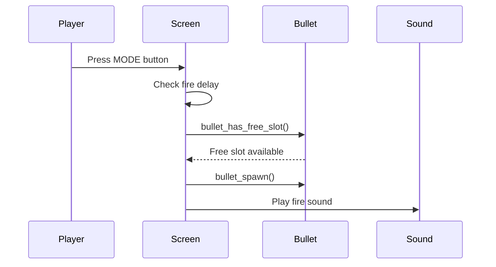
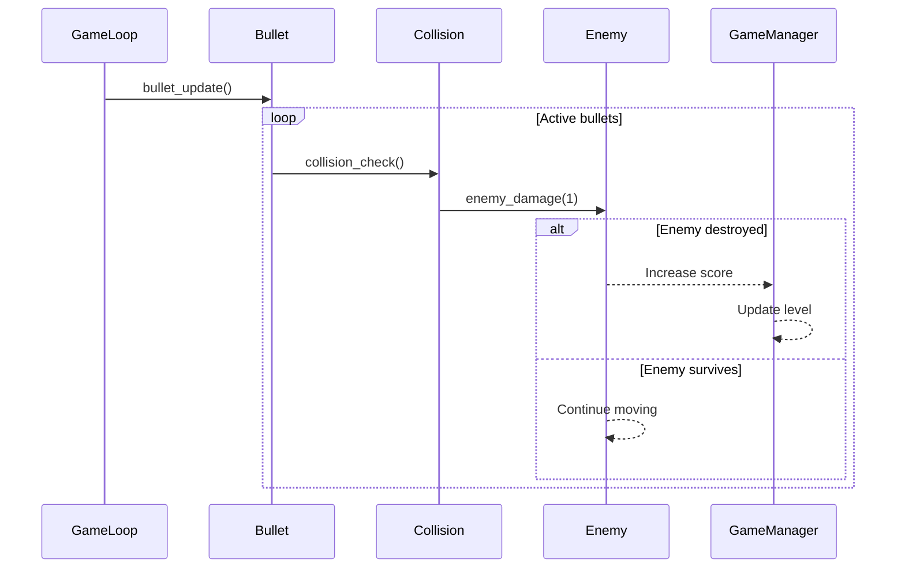
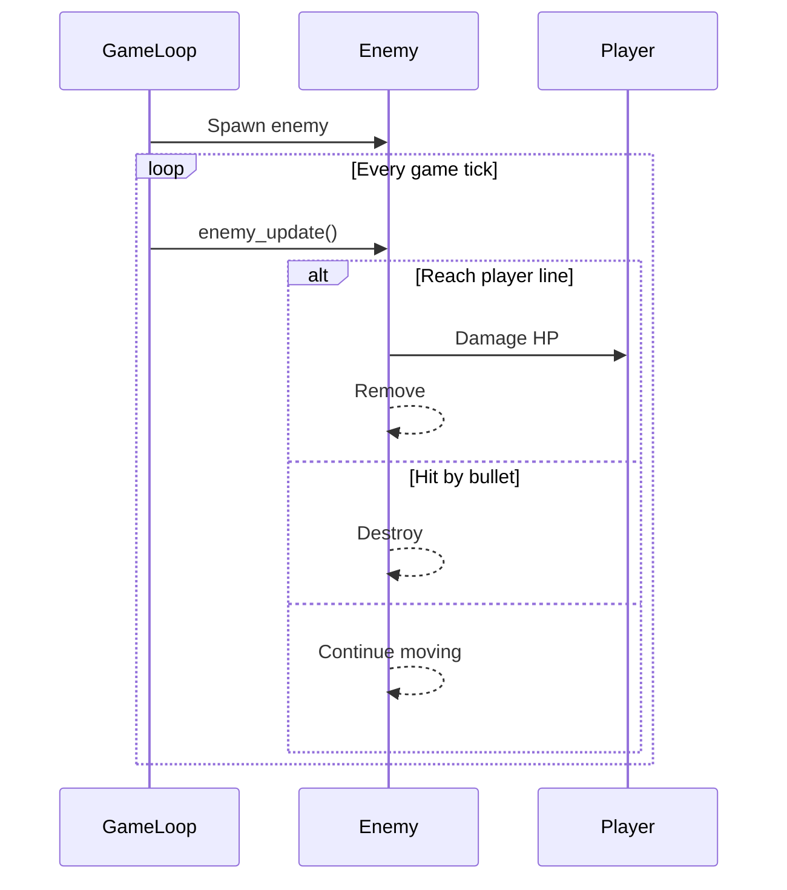

# Software Architecture

---

## 1. Overview

The project follows a modular architecture where the user interface, gameplay logic, rendering system, entity management, and hardware abstraction are separated into independent modules. This organization makes the project easier to maintain, extend, and debug.

The gameplay is driven by an event-based update loop. Each frame updates the game state, processes entity behaviors, performs collision detection, and renders the final frame to the OLED display.

## 2. High-Level Architecture

## 3. Module Responsibilities

| Module | Responsibility |
|----------|----------------|
| Screens | Manage game screens and user interaction |
| Engine | Control gameplay logic and rendering |
| Entity | Define all game objects |
| Assets | Store sprite resources |
| Sound | Manage buzzer sound effects |
### Engine Components

| Component | Responsibility |
|-----------|----------------|
| Game Manager | Initialize and update gameplay |
| Renderer | Draw game objects on the OLED |
| Collision | Detect collisions using AABB |
| Input | Process hardware button events |
### Game Entities

| Entity | Description |
|---------|-------------|
| Player | User-controlled aircraft |
| Bullet | Player projectile |
| Enemy | Regular enemies |
| Boss | Final stage boss |
| Boss Bullet | Boss projectile |

## 4. Runtime Flow

The runtime flow describes how the game processes one frame during execution. Every game tick updates user input, game entities, collision detection, rendering, and audio before displaying the next frame on the OLED display.

## 5. Game Logic Sequences

### 5.1 Game Startup Sequence

The startup sequence initializes the game engine, resets the gameplay state, creates all game entities, and starts the periodic game update timer.

### 5.2 Player Shooting Sequence

When the player presses the MODE button, the game checks whether the player can fire. If a bullet slot is available, a new bullet is created and a firing sound is played.

### 5.3 Bullet Update and Collision Sequence

During each game update, all active bullets move upward. The game checks collisions between bullets and enemies using AABB collision detection. When a collision occurs, the enemy takes damage. Destroyed enemies increase the player's score and level progression.

### 5.4 Enemy Lifecycle Sequence

Enemies are spawned periodically according to the current difficulty level. During each update, enemies move downward. If an enemy reaches the defense line or collides with the player, the player's HP decreases. Destroyed enemies are removed from the game.

    5.5 Boss

    5.6 Collision

    5.7 Game State

## 6. Design Principles