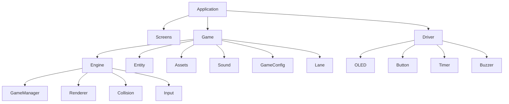
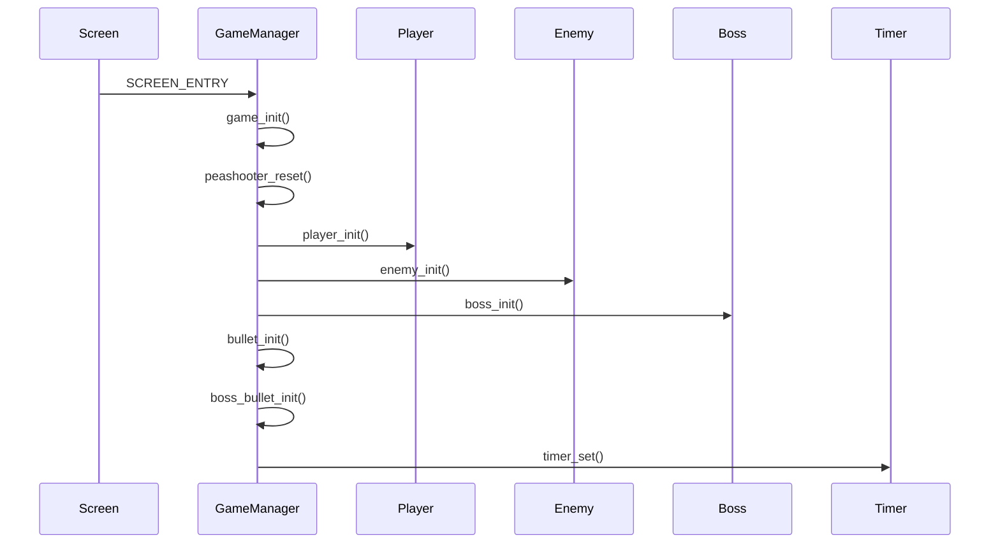
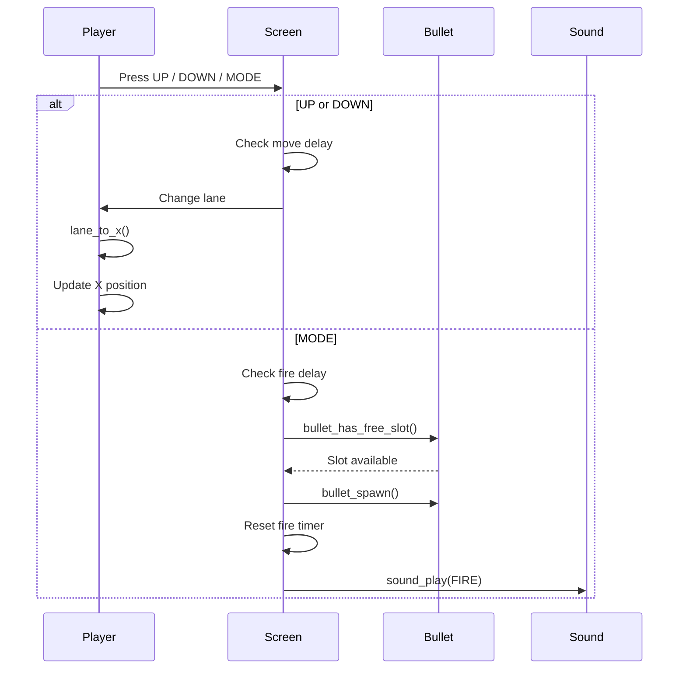
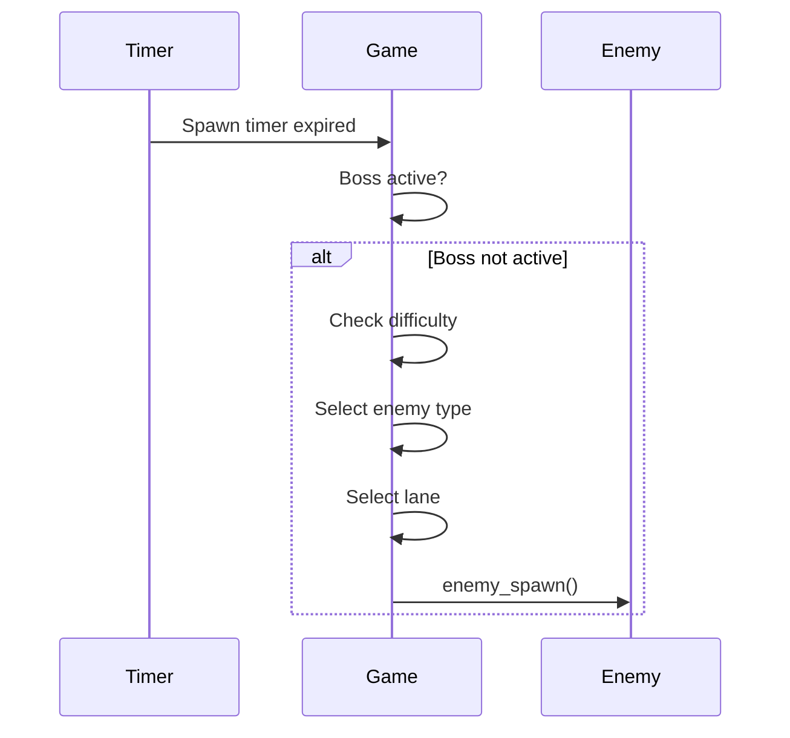
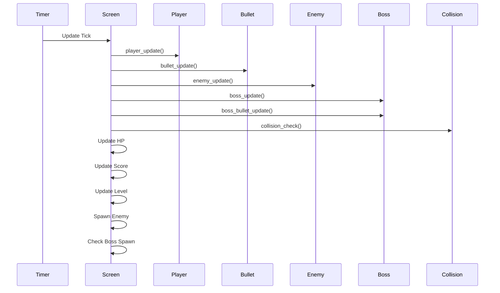
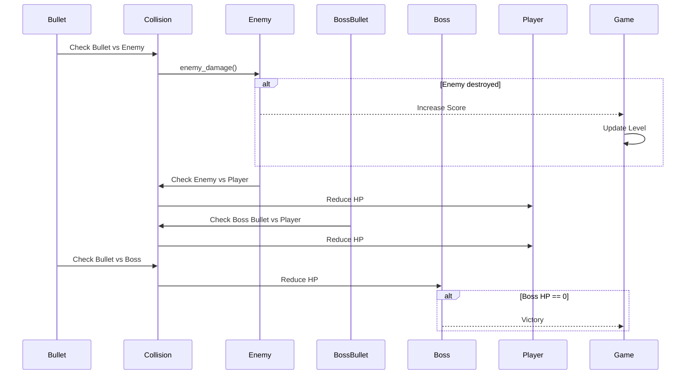
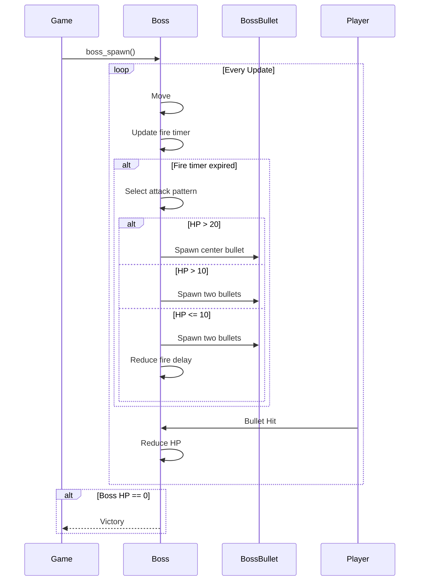
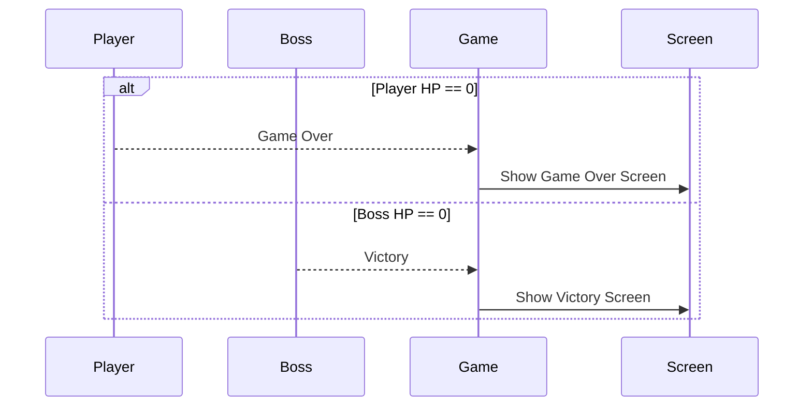

# Software Architecture

---

## 1. Overview

The project follows a modular architecture where the user interface, gameplay logic, rendering system, entity management, and hardware abstraction are separated into independent modules. This organization makes the project easier to maintain, extend, and debug.

The gameplay is driven by periodic timer events and button events. During each timer tick, the game processes player input, updates all entities, performs collision detection, updates the game state, and renders the next frame on the OLED display.

## 2. High-Level Architecture

## 3. Module Responsibilities

| Module | Responsibility |
|----------|----------------|
| Screens | Manage game screens and user interaction |
| Engine | Control gameplay logic and rendering |
| Entity | Define all game objects |
| Assets | Store sprite resources |
| Sound | Manage sound effects and provide sound enable/disable control |
| Driver | Provide hardware abstraction for OLED, buttons, timer, and buzzer |
### Engine Components

| Component | Responsibility |
|-----------|----------------|
| Game Manager | Initialize and update gameplay |
| Renderer | Draw game objects on the OLED |
| Collision | Detect collisions using AABB |
| Input | Process hardware button events |
### Game Entities

| Entity | Description |
|---------|-------------|
| Player | User-controlled aircraft |
| Bullet | Player projectile |
| Enemy | Regular enemies |
| Boss | Final stage boss |
| Boss Bullet | Boss projectile |

## 4. Runtime Flow

The runtime flow describes how the game processes one frame during execution. Every game tick updates user input, game entities, collision detection, rendering, and audio before displaying the next frame on the OLED display.

```mermaid
flowchart LR

A[Timer Update]

A --> B[Read Button Events]

B --> C[Update Player]

C --> D[Update Bullets]

D --> E[Update Enemies]

E --> F[Update Boss]

F --> G[Update Boss Bullets]

G --> H[Collision Detection]

H --> I[Update HP / Score / Level]

I --> J[Update Game State]

J --> K[Spawn Boss or Enemy]

K --> L[Render Frame]

L --> M[OLED Display]

M --> A
```

## 5. Game Logic Sequences

### 5.1 Game Startup Sequence

The startup sequence initializes the game engine, resets the gameplay state, creates all game entities, and starts the periodic game update timer.

### 5.2 Player Input Sequence

When the player presses the MODE button, the game checks whether the player can fire. If a bullet slot is available, a new bullet is created and a firing sound is played.

### 5.3 Enemy Spawn Sequence

Enemy spawning is performed periodically based on the current game level and difficulty mode. The game determines when a new enemy should appear, selects an enemy type, and places it into an available lane.

### 5.4 Gameplay Update Sequence

Enemies are spawned periodically according to the current difficulty level. During each update, enemies move downward. If an enemy reaches the defense line or collides with the player, the player's HP decreases. Destroyed enemies are removed from the game.

### 5.5 Collision Detection Sequence

### 5.6 Boss Battle

The boss battle begins after the player reaches the required level. Unlike regular enemies, the boss has multiple attack phases that change according to its remaining HP.

### 5.7 Game Ending

The game ends when either the player loses all HP or defeats the final boss.

## 6. Design Principles

The software architecture follows several embedded software engineering principles to improve maintainability and scalability.

### -Modular Design

Each subsystem is implemented in an independent module, including player control, enemy management, rendering, collision detection, and sound.

### -Event-Driven Programming

The game is updated through periodic timer events and button events instead of using a blocking loop.

### -Object Pool

Bullets, enemies, and boss bullets are allocated statically to eliminate dynamic memory allocation during gameplay.

### -Separation of Responsibilities

Rendering, game logic, input handling, collision detection, and sound management are implemented independently to reduce module coupling.

### -Reusability

All game entities share a common base entity structure, allowing common operations such as rendering and collision detection to be reused across different object types.
### -Static Memory Allocation

All gameplay objects, including players, enemies, bullets, and boss bullets, are allocated statically. This eliminates dynamic memory allocation during runtime, providing deterministic memory usage and improving reliability on resource-constrained embedded systems.
## 7. Source Code Organization

The software is organized into independent modules to simplify maintenance and future development.

| Directory              | Responsibility                                              |
| ---------------------- | ----------------------------------------------------------- |
| `sources/app/`         | Screen management and application logic                     |
| `sources/game/engine/` | Game manager, rendering, collision detection, and input     |
| `sources/game/entity/` | Player, enemy, boss, bullets, and shared entity definitions |
| `sources/game/assets/` | Bitmap sprites and graphical resources                      |
| `sources/game/`        | Shared gameplay configuration, lane mapping, and utilities  |
| `sources/driver/`      | OLED, buttons, timer, buzzer, and other hardware drivers    |

